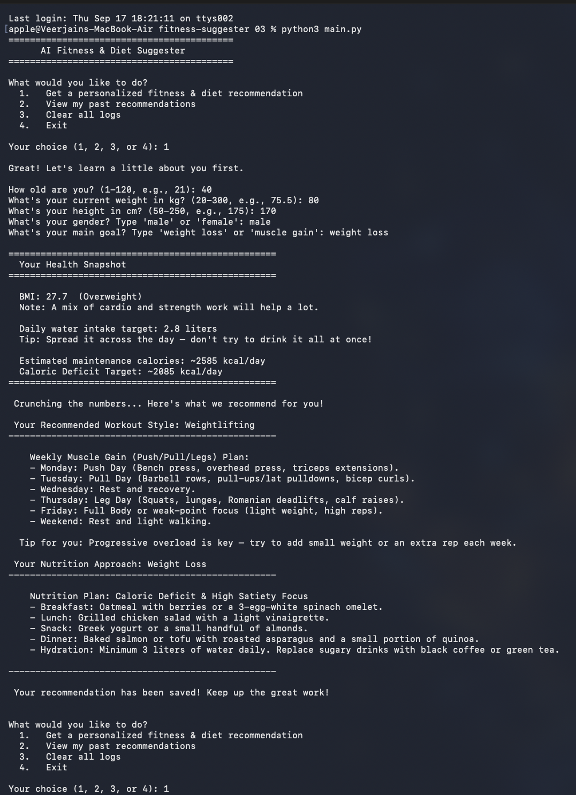

# AI Fitness & Diet Suggester

A beginner-friendly AI + Machine Learning project that provides personalized
workout and diet recommendations based on user inputs like age, weight,
height, gender, and fitness goals.

Built as a course project for **CSA2001 — Fundamentals in AI and ML**.

See [`statement.md`](statement.md) for the full problem statement, scope,
and target users, and [`docs/Project_report.pdf`](docs/Project_report.pdf)
for the complete project report (requirements, design diagrams, testing,
and evaluation).

---

## Features

- ML-based workout recommendation using K-Nearest Neighbours (KNN)
- Suggests workout types: Cardio, Weightlifting, Yoga, HIIT
- Goal-based diet plans: Weight Loss (calorie deficit) or Muscle Gain (calorie surplus)
- Health snapshot: BMI, daily water intake, and calorie estimate (TDEE)
- Session logging to CSV, with options to view or clear past recommendations
- Input validation on every prompt (rejects non-numeric and out-of-range values)

---

## Tech Stack

- Language: Python 3
- Libraries: `pandas`, `scikit-learn`
- Interface: Command Line (CLI)
- Storage: CSV files

## Machine Learning Approach

- Model: K-Nearest Neighbours (`k=3`)
- Features: age, weight, goal (encoded as 0/1)
- Output: predicted workout type
- The model finds the most similar users in the training dataset and
  recommends whichever workout type is most common among their nearest
  neighbours.

---

## Functional Requirements

1. **Personalized recommendation generation** — collect a user profile
   (age, weight, height, gender, goal) and produce a predicted workout
   type plus a matching diet plan.
2. **Health snapshot calculation** — compute and display BMI, daily water
   intake target, and estimated calorie needs (TDEE) from the same profile.
3. **Recommendation history management** — persist every recommendation to
   a CSV log, and let the user view or clear that history on demand.
4. **Input validation workflow** — every CLI prompt loops until it receives
   a value that is both the right type and within a realistic range.

## Non-Functional Requirements

1. **Reliability** — invalid input (wrong type, out-of-range value, blank
   input) never crashes the program; it re-prompts instead.
2. **Usability** — every prompt states the expected format/range inline
   (e.g. `(1-120, e.g., 21)`), and menu options are numbered and re-shown
   after every action.
3. **Maintainability** — logic is split into single-responsibility modules
   (`content`, `health_metrics`, `input_helpers`, `data_manager`,
   `recommender`) so any one part can be changed without touching the rest.
4. **Portability / Resource efficiency** — no external services or
   database are required; the app runs fully offline from CSV files and a
   lightweight in-memory KNN model, and works from any working directory.
5. **Error handling strategy** — file/model errors are caught and reported
   with a clear message rather than raw stack traces.

---
## Project Structure

```
fitness-suggester/
├── README.md
├── requirements.txt
├── .gitignore
├── main.py                        # entry point — run this
├── src/
│   ├── __init__.py
│   ├── content.py                 # workout routines, diet plans, tips
│   ├── health_metrics.py          # BMI / water / TDEE calculations
│   ├── input_helpers.py           # validated CLI input prompts
│   ├── data_manager.py            # dataset bootstrap, model training, CSV logging
│   └── recommender.py             # formats the final recommendation output
├── data/
│   └── fitness_dataset.csv        # starter training data
├── logs/
│   └── user_recommendation_logs.csv   # generated at runtime (git-ignored)
├── statement.md                   # problem statement, scope, target users
├── docs/
│   ├── Project_report.pdf
│   ├── screenshot.png
│   └── diagrams/                  # architecture / UML source (.mmd) + rendered (.png)
└── tests/
    └── test_health_metrics.py     # unit tests for the calculation functions
```

This mirrors the original single-file script's logic exactly, just split
by responsibility: `content.py` (data), `health_metrics.py` and
`data_manager.py` (logic), `input_helpers.py` + `main.py` (I/O and CLI flow).

---

## Setup & Run

```bash
# 1. Clone the repository
git clone <your-repo-url>
cd fitness-suggester

# 2. (Recommended) create a virtual environment
python3 -m venv .venv
source .venv/bin/activate        # Windows: .venv\Scripts\activate

# 3. Install dependencies
pip install -r requirements.txt

# 4. Run the program
python3 main.py
```

On first run it will create `data/fitness_dataset.csv` if it isn't already
present, train the KNN model on it, and drop you into the menu.

### Run the tests

```bash
python3 tests/test_health_metrics.py
# or, if pytest is installed:
pytest tests/
```

---

## Sample Session (Screenshot)


---

## Limitations

- Small training dataset (12 rows) — predictions are illustrative, not clinically precise
- Only 4 workout categories and 2 goals supported
- No persistent user accounts — logs are a flat CSV, not a database
- CLI-only, no graphical interface

## Future Improvements

- Larger, more diverse training dataset
- Add a fitness-level input (beginner/intermediate/advanced)
- Web or Tkinter GUI
- Analyze accumulated user logs for trend insights

---

## Author

Veer Jain — Integrated M.Tech in AI, 2nd Year

## Acknowledgment

Developed as part of the CSA2001 Fundamentals in AI & ML course.
